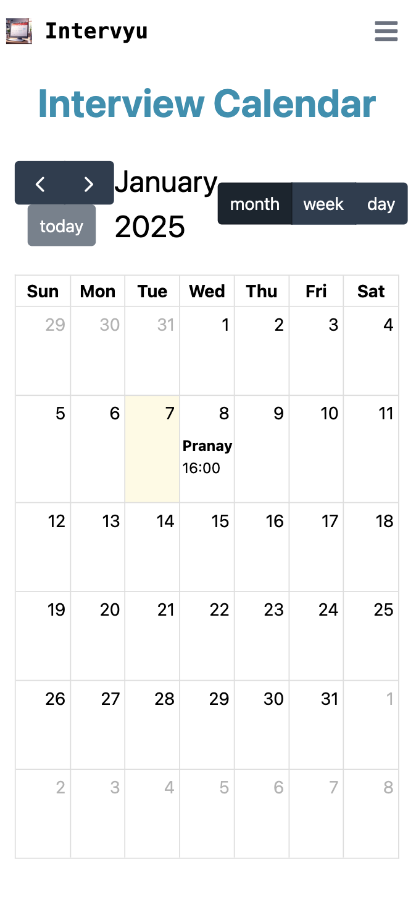

# Intervyu
A functional React application that allows HR/Recruiters to schedule, manage, and view interviews efficiently.

# Live Demo

Check out the live demo of the project: [Intervyu](https://intervyu.vercel.app).

## Technologies Used

- **React.js (v19)**: Frontend framework for building the UI.
- **FullCalendar**: Library for displaying and interacting with the interview schedule in a calendar view.
- **Tailwind-CSS**: Utility-first framework for styling the app and UI components.
- **React-Flowbite**: UI components for building the app (buttons, modals, forms, etc.).
- **React Toastify**: For displaying notifications (e.g., when a candidate is added).
- **React Context-API**: For managing global state (candidate & interviewer state/data).


## 🚀 Project Setup

### 🛠️ Prerequisites

#### Ensure you have the following installed on your machine:
	•	Node.js (v14 or higher) – Download Node.js
	•	npm or yarn – Package Managers

### 📥 1. Clone the Repository

```bash
git clone https://github.com/NimishKr16/Intervyu
```

```bash
cd intervyu
```

### 📦 2. Install Dependencies

```bash
npm install
```

### 💻 4. Run the Development Server

Start the development server locally:

```bash
npm start
```

## 🧠 Key Features

- ✅ **Interview Calendar**: Visualize all scheduled interviews on a calendar.
- ✅ **Time Slot Validation**: Prevent overlapping time slots for the same interviewer.
- ✅ **Editable Events**: Update candidate details, time slots, or interviewers dynamically.
- ✅ **Add Interviewers & Candidates**: Add new candidates and interviewers dynamically with their information
- ✅ **Real-time Feedback**: Immediate feedback on invalid or conflicting slots.
- ✅ **Custom Modal**: View detailed interview information upon event click.

## [Watch Demo Video]([DemoVideo.mp4](https://drive.google.com/file/d/14tU_m_V9dcJi4Qlaj1YLuMaT5daLFLr7/view?usp=sharing))
## Mobile View -


## 🖌️ Design Decisions

-	**Component-Based Architecture**: The project follows a modular, component-based structure using React. This makes the app scalable and easy to maintain, where each feature (e.g., Candidate Modal, Interview Calendar, etc.) is a separate component with specific responsibilities.
-	**State Management**: State management is handled locally within each component using React’s useState. However, for managing global states like candidate data and interviewers, React Context API is utilized, ensuring that data flows smoothly across the app without prop-drilling.
-	**UI/UX**: The design is kept simple and intuitive with a focus on user experience. Flowbite’s modal and button components are used for consistent styling and responsive design. Date and time selection is handled via react-datepicker to provide a smooth user interface for booking and editing interviews.
-	**Time Management**: To ensure that interview slots are booked correctly and no conflicts arise, time validation and filtering logic are built into the date picker. The app prevents users from selecting past dates and only allows valid time intervals, providing a seamless experience.
-	**Toast Notifications**: React Toastify is used for giving real-time feedback to users, notifying them when an action like saving or descheduling an interview is successful. This improves the interactivity and user engagement.

## 🧮 Challenges Faced

 - **Handling Conflicting Slots**: One of the main challenges was ensuring that time slots selected by one user would be unavailable for others. This required setting up logic to track booked slots and validating user inputs when scheduling or editing an interview.
 - **Date and Time Formatting**: Working with date and time formats can be tricky, especially when different time zones or formats are considered. Ensuring that the time slot is displayed and processed consistently was a challenge, and careful attention was paid to format handling using libraries like react-datepicker.
 - **State Synchronization**: Managing global state, especially for candidates, interviewers, and booked slots, required careful handling to avoid inconsistent data. Using React Context API helped with synchronizing state across components, but there were challenges in ensuring the right data was passed down and modified correctly.
 - **User Feedback**: Another challenge was providing meaningful user feedback in case of errors or successful actions, such as when a slot is already booked or when the interview is successfully rescheduled. Ensuring that notifications appear at the right time and are informative required setting up proper conditions and triggers for toast messages.
  
## 📝 Assumptions

- **Interviewer Availability:** It is assumed that the interviewers’ availability is handled through an external system or data source. The app does not track availability on its own but assumes interviewers’ slots can be selected based on available time slots in the calendar.
- **Candidate Data Integrity**: It is assumed that the data for candidates and interviews is well-structured and consistent, with proper date-time values being passed.
- **Single-Day Scheduling**: This app is designed to handle scheduling interviews within a single day and does not currently support multi-day scheduling or time zone considerations, as the focus is on simplicity and functionality for basic use cases.
- **Browser Support**: The app assumes users are accessing it through modern browsers that support features like window.confirm for confirmation dialogs and DatePicker for selecting date and time.
